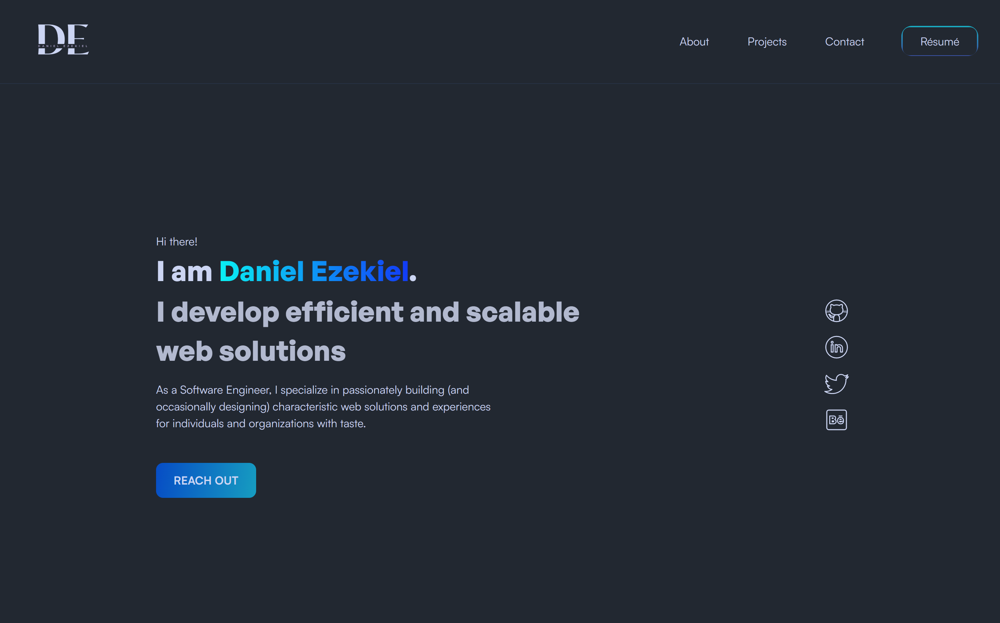

<h1 align="center">Portfolio Website</h1>

<h2 align="center">DanielEzekiel.me - v1</h2>
<h4 align="center">-- HTML, CSS, JavaScript --</h4>

This is the first version of my [**portfolio website**](https://www.danielezekiel.me) and it was designed in Figma and developed by me using HTML, CSS and JavaScript to showcase the different projects I have built using different tools and technologies. Hosting using GitHub pages.

